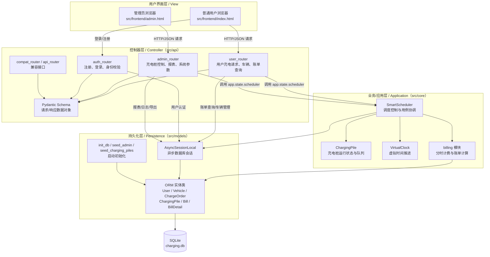

# 智能充电桩与结算系统 —— 概要设计说明书 (SDD)

## 1. 软件架构

### 1.1 软件架构示意图

根据课件中“基于 B/S 结构的软件层次化结构”和 MVC 的说明，本系统采用 **B/S 架构下的分层 MVC 风格**。其中，浏览器页面承担视图层职责，FastAPI 路由对象承担控制器层职责，调度、计费、虚拟时钟等对象承担业务/应用层职责，SQLAlchemy ORM 对象与异步会话承担持久化层职责，SQLite 数据库承担最终数据存储职责。该划分与当前项目目录 `src/frontend`、`src/api`、`src/core`、`src/models` 的代码结构保持一致。



该架构的运行机制如下：用户或管理员在浏览器界面触发操作后，前端通过 HTTP/JSON 调用后端接口；FastAPI 中的 `APIRouter` 对象首先接收系统事件，并通过 Pydantic Schema 对输入数据进行结构化校验，非法请求在控制器层即可被拒绝。通过校验后，控制器对象只负责协调和转发，不直接承担复杂业务规则，而是把“提交充电请求、取消请求、停止充电、控制充电桩、查询队列”等系统事件交给应用层对象处理。

应用层以 `SmartScheduler` 为核心控制对象。系统启动时，`src/main.py` 创建一个 `SmartScheduler(config_data)` 实例并挂载到 `app.state.scheduler`，使所有请求共享同一个调度上下文。`SmartScheduler` 内部组合多个 `ChargingPile` 对象，维护快充、慢充等待队列和各充电桩队列；它使用 `VirtualClock` 获取系统虚拟时间，使用 `billing.calculate_fee()` 完成分时计费，并通过 `asyncio.Lock` 保证并发请求下队列和充电桩状态的一致性。后台任务 `simulate_battery_growth()` 和 `dispatch_watcher()` 负责持续推进充电进度、完成订单结算和触发调度。

持久化层负责对象状态与数据库记录之间的同步。`ChargeOrder`、`Vehicle`、`Bill`、`BillDetail`、`PileStatusLog` 等 ORM 实体类对应数据库中的业务数据对象；`AsyncSessionLocal` 负责创建异步会话，供控制器层和应用层完成查询、插入、更新和提交。这样，业务对象只通过持久化接口保存必要状态，数据库实现变化时影响范围集中在 `src/models`，符合课件中“持久化层将数据库操作封装起来，使数据库变化对业务领域的影响局部化”的设计思想。

从面向对象设计角度看，本架构遵循课件中的控制器模式、创建者模式和信息专家原则。控制器层对象负责接收系统事件；`SmartScheduler` 作为用例控制对象负责创建和管理运行期的 `ChargingPile` 实例，并协调充电请求的完整处理过程；`ChargingPile` 保存自身功率、状态和队列，因此负责计算本桩剩余服务时间；`VirtualClock` 保存时间倍率和基准时间，因此负责提供虚拟时间；ORM 实体对象保存需要持久化的数据状态。各对象围绕自身掌握的信息承担职责，既降低耦合，也提高了模块内聚性。

### 1.2 分层结构说明

本系统采用课件中给出的 B/S 分层思想，可归纳为“用户界面层 + 控制器层 + 业务/应用层 + 持久化层 + 数据库”的五层结构。各层职责如下。

1. **用户界面层**  
   用户界面层位于 `src/frontend`，由 `index.html` 和 `admin.html` 组成。`index.html` 面向普通用户，提供注册登录、车辆管理、提交充电请求、查看排队位置和账单等界面；`admin.html` 面向管理员，提供充电桩监控、故障控制、等待区查看、报表与导出等界面。该层只负责展示数据和收集用户输入，不直接处理调度、计费和持久化规则。

2. **控制器层：负责接收前端请求的对象**  
   控制器层位于 `src/api`，核心对象是各模块的 `APIRouter`：`auth_router` 接收注册、登录和当前用户查询请求；`user_router` 接收普通用户的充电请求、修改/取消/停止请求、车辆管理和账单查询请求；`admin_router` 接收管理员的充电桩控制、等待区查看、报表、计费参数、系统参数和导出请求；`api_router` 与 `compat_router` 用于兼容接口。`schemas.py` 中的 Pydantic 类作为请求和响应的数据传输对象，负责接口数据的结构化约束。控制器层的主要职责是接收系统事件、校验输入、进行身份权限检查，并把请求转交给合适的业务对象。

3. **业务/应用层：负责创建运行期对象并处理请求的对象**  
   业务/应用层位于 `src/core`，其中 `SmartScheduler` 是最核心的用例控制对象。系统启动时，`src/main.py` 根据配置创建 `SmartScheduler` 实例；`SmartScheduler.__init__()` 再依据快充桩数量、慢充桩数量、排队容量和功率配置创建多个 `ChargingPile` 对象，因此它承担运行期充电桩对象的创建与组织职责。  
   具体请求处理也主要由 `SmartScheduler` 完成：`submit_request()` 处理充电请求并分配排队号；`modify_request()` 处理等待区请求修改；`cancel_request()` 和 `stop_charging()` 处理取消和主动停止；`fault_pile()`、`recover_pile()`、`start_pile()` 和 `stop_pile()` 处理管理员对充电桩的控制；`dispatch_from_waiting_area_async()`、`simulate_battery_growth()` 和 `dispatch_watcher()` 负责队列调度、充电推进和状态转换。`ChargingPile` 对象负责保存单个充电桩的状态、功率、队列和累计统计信息；`VirtualClock` 负责虚拟时间；`billing` 模块负责分时电价和服务费计算。

4. **持久化层：负责数据同步和存储的对象**  
   持久化层位于 `src/models`。`database.py` 中的 `engine`、`AsyncSessionLocal`、`init_db()`、`seed_admin()`、`seed_charging_piles()` 负责数据库连接、会话创建、建表和启动初始化；`models.py` 中的 `User`、`Vehicle`、`ChargeOrder`、`ChargingPile`、`PileQueue`、`PileStatusLog`、`Bill`、`BillDetail` 是与数据库表对应的持久化对象。  
   在运行过程中，控制器层会通过 `AsyncSessionLocal` 查询用户、车辆、订单、账单和报表数据；应用层会在调度状态变化时更新 `ChargeOrder`，在充电桩状态变化时写入 `PileStatusLog`，在订单结束时生成 `Bill` 和 `BillDetail`。这些对象负责把内存中的业务状态同步到 `charging.db`，并在服务重启时通过 `restore_from_db()` 恢复未完成订单和队列状态。

5. **数据库层：负责最终物理存储的数据文件**  
   数据库层由项目根目录下的 SQLite 数据库文件 `charging.db` 承担。该层不直接处理业务逻辑，而是保存系统运行过程中需要长期保留的数据，包括用户账号、车辆信息、充电订单、充电桩信息、桩状态变更日志、账单和账单明细等。业务对象和控制器对象不直接拼接 SQL 操作数据库，而是通过 SQLAlchemy ORM 实体和异步会话间接访问数据库，从而保持数据库层与上层业务逻辑的分离。  
   采用 SQLite 的原因是本课程项目属于单站点智能充电桩调度与计费系统，数据规模适中，部署和验收环境要求轻量化；SQLite 可以直接以文件形式保存数据，便于本地演示、测试和迁移。当后续需要升级为 MySQL、PostgreSQL 等数据库时，只需优先调整持久化层的连接配置和少量数据库适配逻辑，业务/应用层的调度和计费对象不需要大规模改动。

## 2. 系统的界面设计

本章后续补充各界面截图、布局说明和主要功能模块位置说明。

### 2.1 顾客充电申请界面设计

本节后续补充顾客提交充电请求相关界面设计。

### 2.2 顾客队列及充电状态查询界面设计

本节后续补充顾客查看排队号码、前车等待数量和充电状态相关界面设计。

### 2.3 顾客账单和详单界面设计

本节后续补充顾客查看账单、详单和收费结果相关界面设计。

### 2.4 管理员监控界面设计：充电桩状态、队列查询、账单及详单查询

本节后续补充管理员查看充电桩状态、队列信息、账单和详单相关界面设计。

## 3. 系统动态结构设计

本章后续根据各用例的系统事件、操作契约和对象职责分配补充 UML 交互图。

### 3.1 用例：车辆充电

#### 3.1.1 已知条件

本节后续补充车辆充电用例的消息、返回值和操作契约。

#### 3.1.2 对象设计：requestCharge 发起充电请求

本节后续补充发起充电请求的对象交互过程。

#### 3.1.3 对象设计：returnQueueInfo 返回队列信息

本节后续补充返回队列信息的对象交互过程。

#### 3.1.4 对象设计：notifyStartCharging 通知开始充电

本节后续补充通知开始充电的对象交互过程。

#### 3.1.5 对象设计：endCharging 结束充电

本节后续补充结束充电的对象交互过程。

#### 3.1.6 对象设计：returnBill 返回账单

本节后续补充返回账单的对象交互过程。

#### 3.1.7 对象设计：pay 支付费用

本节后续补充支付费用的对象交互过程。

#### 3.1.8 对象设计：returnPaymentResult 返回支付结果

本节后续补充返回支付结果的对象交互过程。

### 3.2 用例：查看账单

#### 3.2.1 已知条件

本节后续补充查看账单用例的消息、返回值和操作契约。

#### 3.2.2 对象设计：queryBillInfo 查询账单

本节后续补充查询账单的对象交互过程。

#### 3.2.3 对象设计：returnBillInfo 返回账单详情

本节后续补充返回账单详情的对象交互过程。

### 3.3 用例：调度管理

#### 3.3.1 已知条件

本节后续补充调度管理用例的消息、返回值和操作契约。

#### 3.3.2 对象设计：scheduleRequest 调度请求

本节后续补充调度请求的对象交互过程。

#### 3.3.3 对象设计：returnScheduleResult 返回调度结果

本节后续补充返回调度结果的对象交互过程。

### 3.4 用例：运行和维护充电站

#### 3.4.1 已知条件

本节后续补充运行和维护充电站用例的消息、返回值和操作契约。

#### 3.4.2 对象设计：manageChargeStation 启动/停止充电站

本节后续补充启动/停止充电站的对象交互过程。

#### 3.4.3 对象设计：returnOperationResult 返回操作结果

本节后续补充返回操作结果的对象交互过程。

### 3.5 用例：收费管理

#### 3.5.1 已知条件

本节后续补充收费管理用例的消息、返回值和操作契约。

#### 3.5.2 对象设计：createBill 生成账单及详单

本节后续补充生成账单及详单的对象交互过程。

#### 3.5.3 对象设计：returnBillInfo 返回收费结果

本节后续补充返回收费结果的对象交互过程。

## 4. 系统静态结构设计

本章后续使用 PlantUML 类图及类说明表描述各用例涉及的软件对象、属性、方法和分层关系。

### 4.1 用例：车辆充电类图及类说明

本节后续补充车辆充电用例的类图及类说明。

### 4.2 用例：查看账单类图及类说明

本节后续补充查看账单用例的类图及类说明。

### 4.3 用例：调度管理类图及类说明

本节后续补充调度管理用例的类图及类说明。

### 4.4 用例：运行和维护充电站类图及类说明

本节后续补充运行和维护充电站用例的类图及类说明。

### 4.5 用例：收费管理类图及类说明

本节后续补充收费管理用例的类图及类说明。

### 4.6 系统级完整分层类图

本节后续补充系统级完整分层类图。

## 5. 工作量统计

| 成员 | 主要负责内容 |
| --- | --- |
| 曹伊凡 | 软件架构、分层结构说明、车辆充电部分动态图、运行维护充电站动态图、对应静态类图、全文格式统稿 |
| 卓丹琇 | 顾客端界面设计、车辆充电与查看账单相关动态结构设计、顾客相关静态类图 |
| 陈辅杭 | 管理员界面设计、调度管理、收费管理、账单详单、系统级静态结构类图 |


```plantUML
@startuml
skinparam classAttributeIconSize 0
skinparam packageStyle rectangle
skinparam linetype ortho

package "控制器层 src/api" {
  class AdminRouter <<APIRouter>> {
    +control_pile(pile_id, body, request, admin)
    +get_all_piles(request, admin)
    +get_waiting_area(request, admin)
    +get_pile_status_logs(pile_id, limit, offset, admin)
    +get_clock(request, admin)
    +set_clock(body, request, admin)
    +get_system_params(request, admin)
    +update_system_params(body, request, admin)
  }
  class PileControlRequest <<DTO>> { +action: str\n+duration_minutes: Optional[float] }
  class PileControlResponse <<DTO>> { +status: str\n+message: str\n+pile_id: str }
  class SystemStatusResponse <<DTO>> { +piles: List[PileStatus]\n+fast_waiting_count: int\n+slow_waiting_count: int }
  class WaitingAreaResponse <<DTO>> { +fast_waiting: List[WaitingCarDetail]\n+slow_waiting: List[WaitingCarDetail] }
  class PileStatusLogResponse <<DTO>> { +logs: List[PileStatusLogItem]\n+total: int }
  class ClockSetBody <<DTO>> { +datetime: Optional[str]\n+ratio: Optional[float] }
  class SystemParamsUpdate <<DTO>> { +waiting_area_size: Optional[int]\n+pile_queue_length: Optional[int]\n+alpha: Optional[float]\n+beta: Optional[float]\n+gamma: Optional[float] }
}

package "业务/应用层 src/core" {
  class SmartScheduler <<UseCase Controller>> {
    +piles: List[ChargingPile]
    +clock: VirtualClock
    +start_pile(pile_id): dict
    +stop_pile(pile_id): dict
    +fault_pile(pile_id, duration_minutes): dict
    +recover_pile(pile_id): dict
    +get_system_status(): dict
    +get_waiting_area(): dict
    +update_system_params(params): dict
    -_log_pile_status(pile_id, old_status, new_status, reason, operator)
  }
  class ChargingPile <<Runtime Entity>> {
    +pile_id: str
    +type: str
    +power: float
    +status: str
    +queue: List[dict]
    +has_space: bool
    +is_idle: bool
    +remaining_time_hours(): float
  }
  class VirtualClock <<System Service>> {
    +ratio: float
    +get_time(): datetime
    +set_time(dt)
    +set_ratio(ratio)
    +reset()
  }
}

package "持久化层 src/models" {
  class ORMChargingPile <<ORM Entity>> { +pile_id: str\n+pile_type: str\n+status: str\n+total_charge_count: int\n+total_charge_duration: float\n+total_charge_amount: float }
  class PileStatusLog <<ORM Entity>> { +pile_id: str\n+old_status: str\n+new_status: str\n+reason: str\n+operator: str\n+changed_at: DateTime }
  class AsyncSessionLocal <<DB Session>>
}

AdminRouter ..> PileControlRequest : 接收控制参数
AdminRouter ..> PileControlResponse : 返回控制结果
AdminRouter ..> SystemStatusResponse : 返回桩状态
AdminRouter ..> WaitingAreaResponse : 返回等待区
AdminRouter ..> PileStatusLogResponse : 返回状态日志
AdminRouter ..> ClockSetBody : 设置虚拟时钟
AdminRouter ..> SystemParamsUpdate : 设置调度参数
AdminRouter --> SmartScheduler : request.app.state.scheduler
SmartScheduler "1" *-- "多" ChargingPile : 创建并维护
SmartScheduler "1" *-- "1" VirtualClock : 持有虚拟时钟
SmartScheduler ..> AsyncSessionLocal : 读写数据库
SmartScheduler ..> PileStatusLog : 记录状态变更
AsyncSessionLocal ..> ORMChargingPile : 持久化充电桩
AsyncSessionLocal ..> PileStatusLog : 持久化日志
@enduml
```