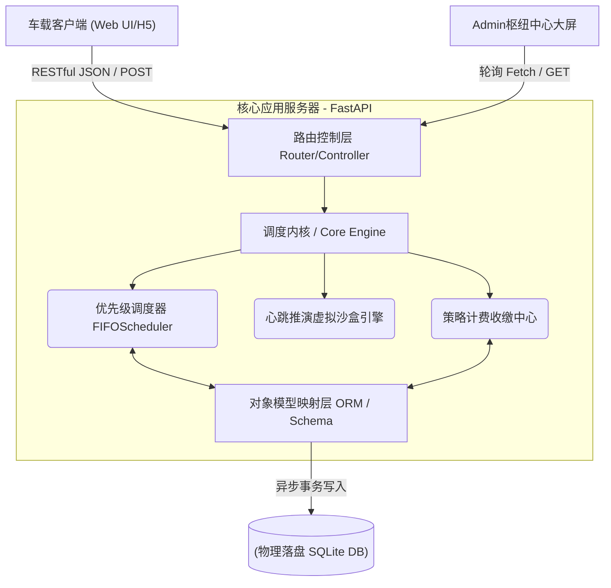

# 智能充电桩与结算系统 —— 概要设计说明书 (SDD)

## 1. 系统宏观架构设计
本系统从传统单体应用升级为现代化跨端联动层，整体采用 **微服务级别的 MVC 结构** 运作，确保模块隔离、易于并行开发分配：

## 2. 核心业务流与心脏引擎说明

### 2.1 流量漏斗防爆（API拦截器）
在最前置的 Router 层，利用 FastAPI 的 `Pydantic` Schema 对非法输入、恶意刷包缺省参数进行了严密的静态对象截获过滤。在透传到等候区后，进行两级保险——一旦 `现有占用额度 + 排队池长数` $\ge$ `等候区最大容量 M`，系统即刻触发熔断异常机制 `Rejected` 直接踢回数据链路层，从物理上隔绝了脏数据与越界负载进入主板内存。

### 2.2 多轨异步调度栈 (Core Scheduler)
在后台服务独占了单例空间（挂靠于 `app.state` 对象）。其核心职能为独立接管两个严格隔绝的资源池序列（【快充堆】及【常规堆】）。该引擎依靠 `asyncio.Lock` 加持，彻底杜绝高并发多发包造成的脏读抢占。任何实体发生状态变迁（拔枪离场/断网阻断），该引擎都将顺应最新队列快照并触发二次分配重算策略。

### 2.3 心跳沙盒模块 (Virtual Time Sandbox)
系统摒弃了死等现实时间的低级设计，将时间推进能力赋予了内置的 `VirtualClock` 控制器并交予后台并行轮询作业线管理。在此沙盒作用域下，所有排队时长、电力涌入灌输进展，全部被抽象为按比例动态压缩提纯的数据推演动作（如现实度过 $1000 \text{ms}$，虚拟账面折算执行 $1 \text{min}$ 并发出异步回调更新物理表）。

## 3. 数据库与领域模型（持久化实体）

底盘完全解耦了系统内存变量导致的脆弱性，全面引入原生兼具强硬锁表与异步并发读写的 **`SQLAlchemy` + 异步关系型方言** 范式。

### 核心物化表提要：`charge_order` 订单中心事务
该主表完整收缴并贯穿了该系统一单一命由生至死的每个痕迹节点：
* **实体与链路锚点**：唯一定位票据流水 `order_id` (PK)，用户终端信源凭证 `vehicle_id`，实体桩堆强绑定关联码 `pile_id`。
* **闭环受控状态枚举**：`status` [ 排队挂起 (`QUEUING`) $\rightarrow$ 输能中转 (`CHARGING`) $\rightarrow$ 尾款生成结清落账 (`COMPLETED`) ]
* **数值域跟踪**：系统入场时实报表显 `start_soc`, 不间断沙盒跟进重写推送 `current_soc`, 由外围发配而设的硬终止阀门刻度 `target_soc`。
* **纪元时刻溯源线簇**：登记实际拨号进栈时间 `created_at`、准许对接供电起飞时间 `started_at`、物理落闸阻断供电时刻 `finished_at`。这三个强时间戳将构筑起未来惩戒违章占桩以及执行复杂天然时间段阶梯收费计价公式的所有呈堂算力依据。

## 4. 全栈交互前置代理层
打破工程僵局，无需开辟隔离调试机架。我们在 FastApi 底层重载同位端口挂载了全息前端资产的 `StaticFiles`。既满足了严格执行无脚手架依赖的【原生 Web 交付规定】，又打响了零秒构建、免跨域处理的“开箱即用”高要求产品级别演示战斗。
