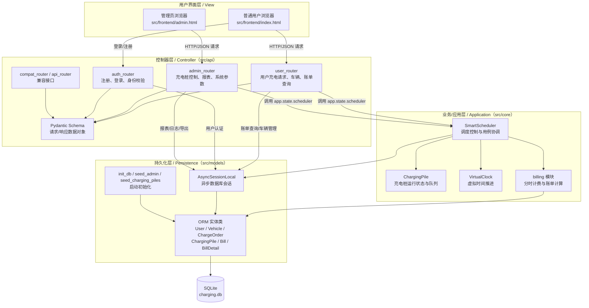

# 智能充电桩与结算系统 —— 概要设计说明书 (SDD)

## 1. 软件架构

### 1.1 软件架构示意图

根据课件中“基于 B/S 结构的软件层次化结构”和 MVC 的说明，本系统采用 **B/S 架构下的分层 MVC 风格**。其中，浏览器页面承担视图层职责，FastAPI 路由对象承担控制器层职责，调度、计费、虚拟时钟等对象承担业务/应用层职责，SQLAlchemy ORM 对象与异步会话承担持久化层职责，SQLite 数据库承担最终数据存储职责。该划分与当前项目目录 `src/frontend`、`src/api`、`src/core`、`src/models` 的代码结构保持一致。

该架构的运行机制如下：用户或管理员在浏览器界面触发操作后，前端通过 HTTP/JSON 调用后端接口；FastAPI 中的 `APIRouter` 对象首先接收系统事件，并通过 Pydantic Schema 对输入数据进行结构化校验，非法请求在控制器层即可被拒绝。通过校验后，控制器对象只负责协调和转发，不直接承担复杂业务规则，而是把“提交充电请求、取消请求、停止充电、控制充电桩、查询队列”等系统事件交给应用层对象处理。

应用层以 `SmartScheduler` 为核心控制对象。系统启动时，`src/main.py` 创建一个 `SmartScheduler(config_data)` 实例并挂载到 `app.state.scheduler`，使所有请求共享同一个调度上下文。`SmartScheduler` 内部组合多个 `ChargingPile` 对象，维护快充、慢充等待队列和各充电桩队列；它使用 `VirtualClock` 获取系统虚拟时间，使用 `billing.calculate_fee()` 完成分时计费，并通过 `asyncio.Lock` 保证并发请求下队列和充电桩状态的一致性。后台任务 `simulate_battery_growth()` 和 `dispatch_watcher()` 负责持续推进充电进度、完成订单结算和触发调度。

持久化层负责对象状态与数据库记录之间的同步。`ChargeOrder`、`Vehicle`、`Bill`、`BillDetail`、`PileStatusLog` 等 ORM 实体类对应数据库中的业务数据对象；`AsyncSessionLocal` 负责创建异步会话，供控制器层和应用层完成查询、插入、更新和提交。这样，业务对象只通过持久化接口保存必要状态，数据库实现变化时影响范围集中在 `src/models`，符合课件中“持久化层将数据库操作封装起来，使数据库变化对业务领域的影响局部化”的设计思想。

从面向对象设计角度看，本架构遵循课件中的控制器模式、创建者模式和信息专家原则。控制器层对象负责接收系统事件；`SmartScheduler` 作为用例控制对象负责创建和管理运行期的 `ChargingPile` 实例，并协调充电请求的完整处理过程；`ChargingPile` 保存自身功率、状态和队列，因此负责计算本桩剩余服务时间；`VirtualClock` 保存时间倍率和基准时间，因此负责提供虚拟时间；ORM 实体对象保存需要持久化的数据状态。各对象围绕自身掌握的信息承担职责，既降低耦合，也提高了模块内聚性。

### 1.2 分层结构说明

本系统采用课件中给出的 B/S 分层思想，可归纳为“用户界面层 + 控制器层 + 业务/应用层 + 持久化层 + 数据库”的五层结构。各层职责如下。

1. **用户界面层**  
   用户界面层位于 `src/frontend`，由 `index.html` 和 `admin.html` 组成。`index.html` 面向普通用户，提供注册登录、车辆管理、提交充电请求、查看排队位置和账单等界面；`admin.html` 面向管理员，提供充电桩监控、故障控制、等待区查看、报表与导出等界面。该层只负责展示数据和收集用户输入，不直接处理调度、计费和持久化规则。

2. **控制器层：负责接收前端请求的对象**  
   控制器层位于 `src/api`，核心对象是各模块的 `APIRouter`：`auth_router` 接收注册、登录和当前用户查询请求；`user_router` 接收普通用户的充电请求、修改/取消/停止请求、车辆管理和账单查询请求；`admin_router` 接收管理员的充电桩控制、等待区查看、报表、计费参数、系统参数和导出请求；`api_router` 与 `compat_router` 用于兼容接口。`schemas.py` 中的 Pydantic 类作为请求和响应的数据传输对象，负责接口数据的结构化约束。控制器层的主要职责是接收系统事件、校验输入、进行身份权限检查，并把请求转交给合适的业务对象。

3. **业务/应用层：负责创建运行期对象并处理请求的对象**  
   业务/应用层位于 `src/core`，其中 `SmartScheduler` 是最核心的用例控制对象。系统启动时，`src/main.py` 根据配置创建 `SmartScheduler` 实例；`SmartScheduler.__init__()` 再依据快充桩数量、慢充桩数量、排队容量和功率配置创建多个 `ChargingPile` 对象，因此它承担运行期充电桩对象的创建与组织职责。  
   具体请求处理也主要由 `SmartScheduler` 完成：`submit_request()` 处理充电请求并分配排队号；`modify_request()` 处理等待区请求修改；`cancel_request()` 和 `stop_charging()` 处理取消和主动停止；`fault_pile()`、`recover_pile()`、`start_pile()` 和 `stop_pile()` 处理管理员对充电桩的控制；`dispatch_from_waiting_area_async()`、`simulate_battery_growth()` 和 `dispatch_watcher()` 负责队列调度、充电推进和状态转换。`ChargingPile` 对象负责保存单个充电桩的状态、功率、队列和累计统计信息；`VirtualClock` 负责虚拟时间；`billing` 模块负责分时电价和服务费计算。

4. **持久化层：负责数据同步和存储的对象**  
   持久化层位于 `src/models`。`database.py` 中的 `engine`、`AsyncSessionLocal`、`init_db()`、`seed_admin()`、`seed_charging_piles()` 负责数据库连接、会话创建、建表和启动初始化；`models.py` 中的 `User`、`Vehicle`、`ChargeOrder`、`ChargingPile`、`PileQueue`、`PileStatusLog`、`Bill`、`BillDetail` 是与数据库表对应的持久化对象。  
   在运行过程中，控制器层会通过 `AsyncSessionLocal` 查询用户、车辆、订单、账单和报表数据；应用层会在调度状态变化时更新 `ChargeOrder`，在充电桩状态变化时写入 `PileStatusLog`，在订单结束时生成 `Bill` 和 `BillDetail`。这些对象负责把内存中的业务状态同步到 `charging.db`，并在服务重启时通过 `restore_from_db()` 恢复未完成订单和队列状态。

5. **数据库层：负责最终物理存储的数据文件**  
   数据库层由项目根目录下的 SQLite 数据库文件 `charging.db` 承担。该层不直接处理业务逻辑，而是保存系统运行过程中需要长期保留的数据，包括用户账号、车辆信息、充电订单、充电桩信息、桩状态变更日志、账单和账单明细等。业务对象和控制器对象不直接拼接 SQL 操作数据库，而是通过 SQLAlchemy ORM 实体和异步会话间接访问数据库，从而保持数据库层与上层业务逻辑的分离。  
   采用 SQLite 的原因是本课程项目属于单站点智能充电桩调度与计费系统，数据规模适中，部署和验收环境要求轻量化；SQLite 可以直接以文件形式保存数据，便于本地演示、测试和迁移。当后续需要升级为 MySQL、PostgreSQL 等数据库时，只需优先调整持久化层的连接配置和少量数据库适配逻辑，业务/应用层的调度和计费对象不需要大规模改动。

## 2. 核心业务流与心脏引擎说明

### 2.1 流量漏斗防爆（API拦截器）
在最前置的 Router 层，利用 FastAPI 的 `Pydantic` Schema 对非法输入、恶意刷包缺省参数进行了严密的静态对象截获过滤。在透传到等候区后，进行两级保险——一旦 `现有占用额度 + 排队池长数` $\ge$ `等候区最大容量 M`，系统即刻触发熔断异常机制 `Rejected` 直接踢回数据链路层，从物理上隔绝了脏数据与越界负载进入主板内存。

### 2.2 多轨异步调度栈 (Core Scheduler)
在后台服务独占了单例空间（挂靠于 `app.state` 对象）。其核心职能为独立接管两个严格隔绝的资源池序列（【快充堆】及【常规堆】）。该引擎依靠 `asyncio.Lock` 加持，彻底杜绝高并发多发包造成的脏读抢占。任何实体发生状态变迁（拔枪离场/断网阻断），该引擎都将顺应最新队列快照并触发二次分配重算策略。

### 2.3 心跳沙盒模块 (Virtual Time Sandbox)
系统摒弃了死等现实时间的低级设计，将时间推进能力赋予了内置的 `VirtualClock` 控制器并交予后台并行轮询作业线管理。在此沙盒作用域下，所有排队时长、电力涌入灌输进展，全部被抽象为按比例动态压缩提纯的数据推演动作（如现实度过 $1000 \text{ms}$，虚拟账面折算执行 $1 \text{min}$ 并发出异步回调更新物理表）。

## 3. 数据库与领域模型（持久化实体）

底盘完全解耦了系统内存变量导致的脆弱性，全面引入原生兼具强硬锁表与异步并发读写的 **`SQLAlchemy` + 异步关系型方言** 范式。

### 核心物化表提要：`charge_order` 订单中心事务
该主表完整收缴并贯穿了该系统一单一命由生至死的每个痕迹节点：
* **实体与链路锚点**：唯一定位票据流水 `order_id` (PK)，用户终端信源凭证 `vehicle_id`，实体桩堆强绑定关联码 `pile_id`。
* **闭环受控状态枚举**：`status` [ 排队挂起 (`QUEUING`) $\rightarrow$ 输能中转 (`CHARGING`) $\rightarrow$ 尾款生成结清落账 (`COMPLETED`) ]
* **数值域跟踪**：系统入场时实报表显 `start_soc`, 不间断沙盒跟进重写推送 `current_soc`, 由外围发配而设的硬终止阀门刻度 `target_soc`。
* **纪元时刻溯源线簇**：登记实际拨号进栈时间 `created_at`、准许对接供电起飞时间 `started_at`、物理落闸阻断供电时刻 `finished_at`。这三个强时间戳将构筑起未来惩戒违章占桩以及执行复杂天然时间段阶梯收费计价公式的所有呈堂算力依据。

## 4. 全栈交互前置代理层
打破工程僵局，无需开辟隔离调试机架。我们在 FastApi 底层重载同位端口挂载了全息前端资产的 `StaticFiles`。既满足了严格执行无脚手架依赖的【原生 Web 交付规定】，又打响了零秒构建、免跨域处理的“开箱即用”高要求产品级别演示战斗。
