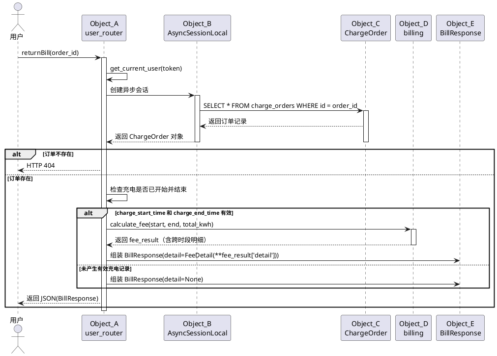
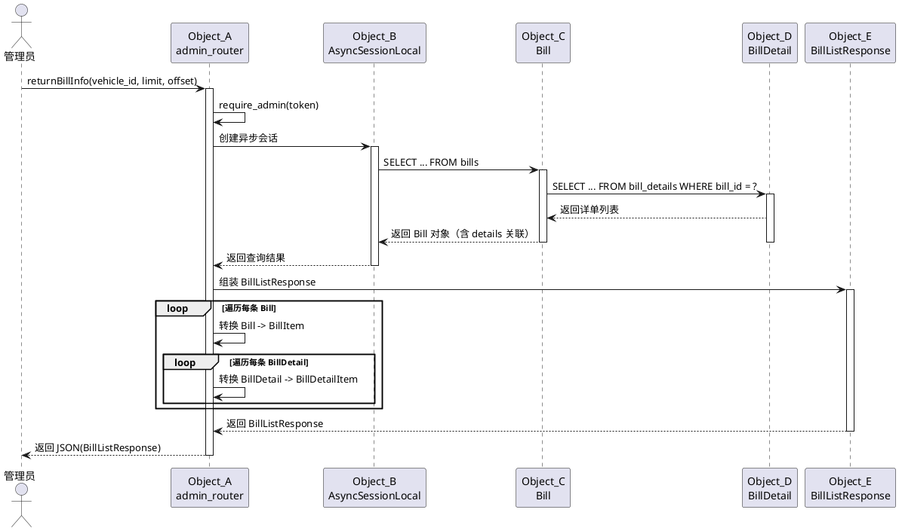
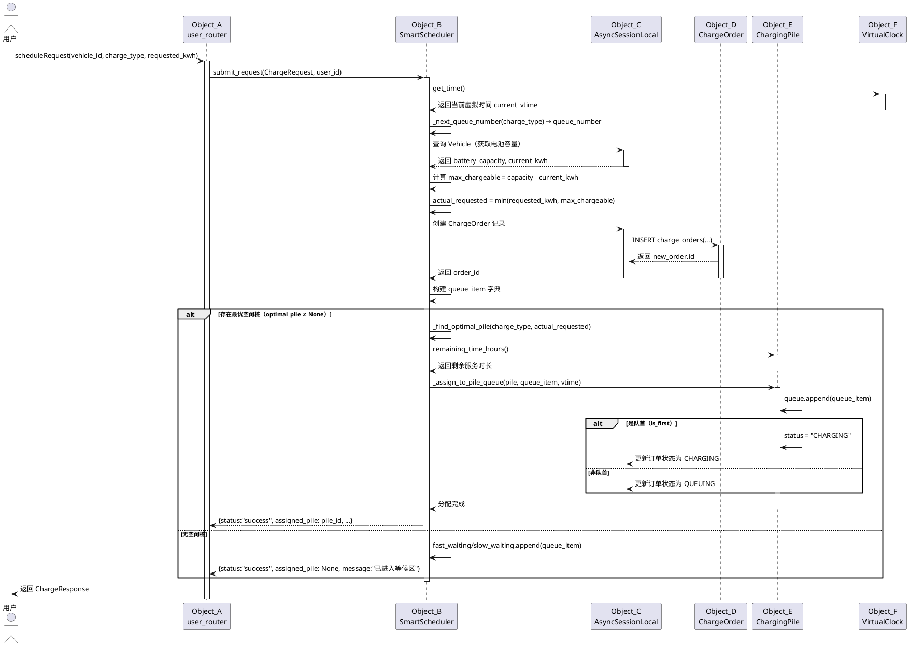
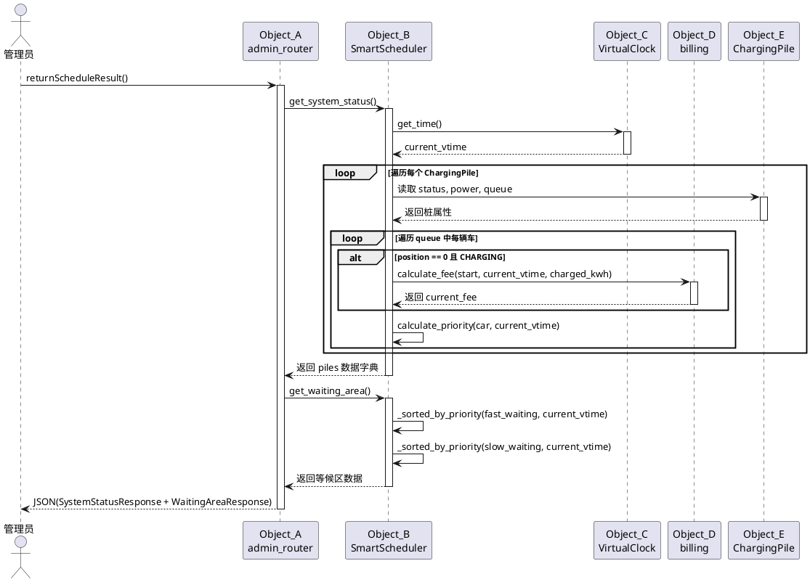
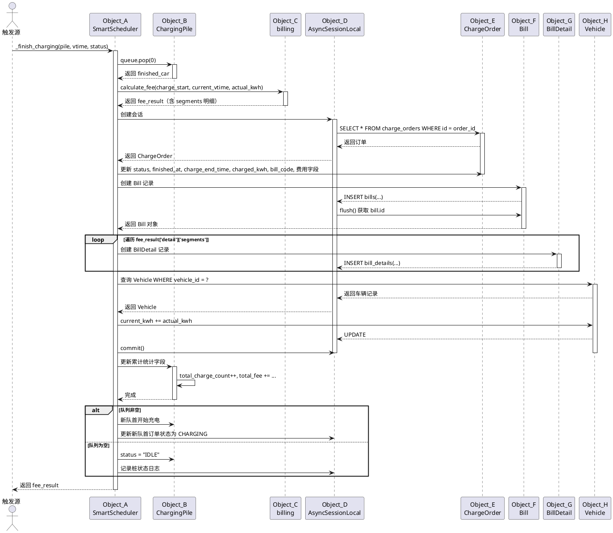
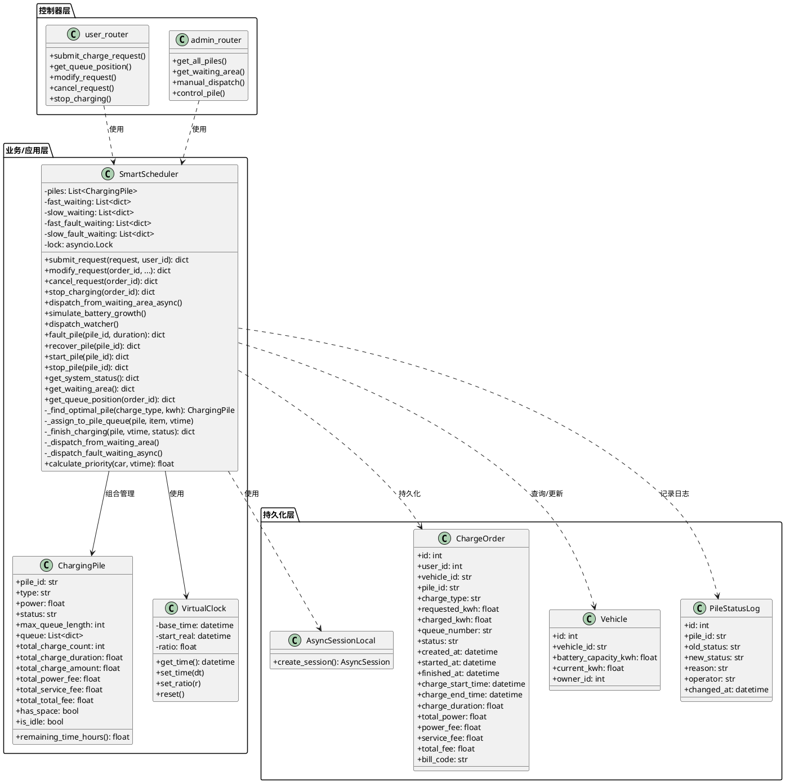
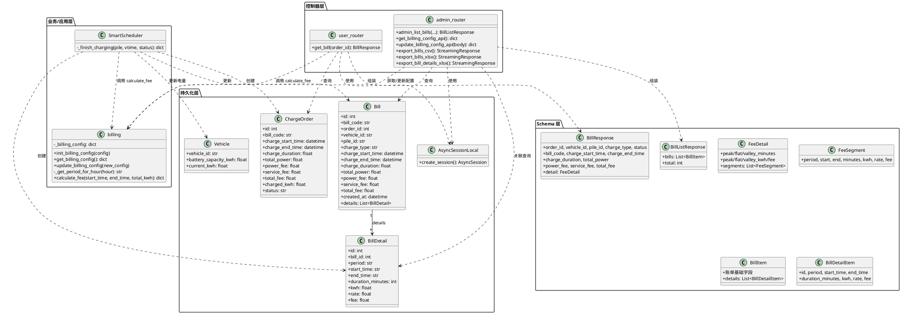
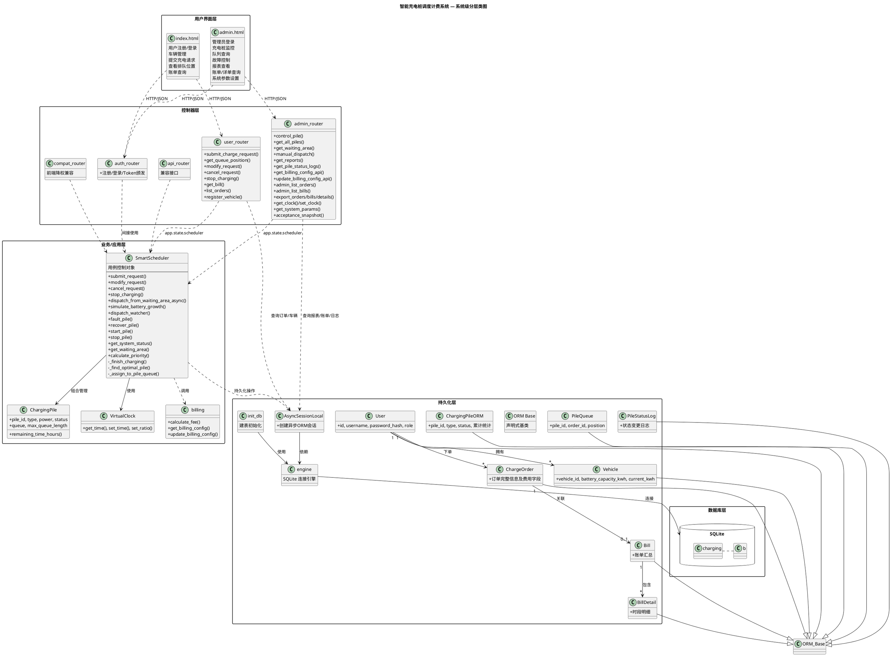

# 陈辅杭 概要设计分工内容

---

## 2.4 管理员监控界面设计：充电桩状态、队列查询、账单及详单查询

### 2.4.1 界面布局总体说明

管理员监控界面采用单页应用（SPA）架构，通过顶部导航栏切换功能标签页。界面设计风格为现代毛玻璃（Glassmorphism）风格，使用 Tailwind CSS 构建响应式布局，适配大屏监控场景。核心标签页包括：

- **实时监控**：充电桩状态与队列可视化
- **数据报表**：充电桩运营统计报表
- **订单管理**：所有订单的查询与筛选
- **系统设置**：计费参数、系统参数、虚拟时钟配置
- **状态日志**：充电桩状态变更历史

### 2.4.2 充电桩状态监控界面

#### 布局结构

界面顶部为统计概览卡片栏，横向排列 6 个关键指标卡片：

| 卡片名称 | 显示内容 |
|---------|---------|
| 快充桩 | 总数量（3） |
| 快充可用 | 可使用数量 |
| 慢充桩 | 总数量（2） |
| 慢充可用 | 可使用数量 |
| 等候车辆 | 等候区总车辆数 |
| 今日充电 | 今日累计充电次数 |

下方主体区域分为左右两栏布局：左侧占 2/3 宽度为**充电区控制面板**，右侧占 1/3 宽度为**等候区队列面板**。

#### 充电区控制面板

充电区按充电桩类型分组展示，每组以卡片网格排列：

- **快充桩区域**：标签为 "⚡ 快充桩"，可用数量/总数动态显示，功率标注为 "30度/小时"。下方以 3 列网格展示 F1、F2、F3 三个快充桩卡片。
- **慢充桩区域**：标签为 "🔌 慢充桩"，可用数量/总数动态显示，功率标注为 "10度/小时"。下方以 2 列网格展示 T1、T2 两个慢充桩卡片。

每个充电桩卡片（pile-card）包含以下内容：

1. **桩头信息**：桩编号（如 F1）、状态徽章（IDLE/CHARGING/FAULT）、类型徽章（Fast/Slow）
2. **实时数据**：当前功率、队列长度/最大容量、累计充电次数、累计充电时长
3. **队列列表**：以纵向列表展示该桩当前排队车辆，每辆车显示：
   - position=0（正在充电）：车牌号、排队号、已充电量/请求电量、当前累计费用、充电开始时间
   - position>0（排队中）：车牌号、排队号、请求电量、优先级分数、SOC、等待时长
4. **操作按钮**：根据状态显示不同的控制按钮
   - IDLE 状态："设置故障"按钮
   - CHARGING 状态："设置故障"按钮
   - FAULT 状态："恢复使用"按钮

充电桩卡片根据状态有不同视觉样式：
- `charging` 类：绿色渐变边框，表示正在充电
- `fault` 类：红色渐变边框，表示故障状态

#### 故障操作交互

在充电区面板右上角提供"故障持续时间"输入框（默认 30 分钟）。管理员点击"设置故障"后，前端调用 `POST /api/admin/piles/{pile_id}/control` 接口，action 为 "fault"，并传入 duration_minutes。系统后台将：
1. 停止当前充电车辆并生成账单（故障中断状态）
2. 将排队车辆按优先级策略重新调度到同类型其他桩
3. 若设置了持续时间，到达后自动恢复

### 2.4.3 队列查询界面

#### 等候区队列面板

位于实时监控页右侧 1/3 区域，分为上下两部分：

- **快充等候区**：显示 fast_waiting 列表中的车辆，每辆车以 queue-card 形式展示
  - 车牌号、排队号（如 F3）、请求电量
  - 动态优先级分数（P_i）、SOC（电池剩余百分比）、已等待分钟数
  - 列表按优先级降序排列
- **慢充等候区**：显示 slow_waiting 列表中的车辆，格式同上

在等候区面板底部提供**手动调度按钮**："立即调度等候区车辆"。点击后调用 `POST /api/admin/dispatch`，触发后台从等候区向桩队列的优先级调度。

#### 队列数据刷新机制

前端通过定时轮询（每 2 秒）调用 `GET /api/admin/piles` 和 `GET /api/admin/waiting-area` 接口，实时更新充电桩状态和等候区数据。

### 2.4.4 账单及详单查询界面

账单及详单查询位于**订单管理**标签页内，界面分为上下两部分：

#### 账单列表区域（上部）

以表格形式展示所有账单，支持按车牌号筛选。表格列包括：

| 列名 | 说明 |
|-----|------|
| 账单编号 | bill_code（如 BILL20260523120000XXXXXX） |
| 订单ID | 关联订单 |
| 车牌号 | vehicle_id |
| 充电桩 | pile_id |
| 充电模式 | Fast / Slow |
| 充电时长 | charge_duration（小时） |
| 充电电量 | total_power（kWh） |
| 充电费 | power_fee（元） |
| 服务费 | service_fee（元） |
| 总费用 | total_fee（元） |
| 开始时间 | charge_start_time |
| 结束时间 | charge_end_time |
| 操作 | "查看详单"按钮 |

数据通过 `GET /api/admin/bills` 接口获取，响应结构为 `BillListResponse`，内部包含 `BillItem` 列表，每个 `BillItem` 嵌套 `details` 详单列表。

#### 详单弹窗区域（下部/弹窗）

点击"查看详单"后，弹出模态窗口（modal）展示该账单的跨时段费用明细。弹窗内容包括：

- 账单基础信息（车牌、桩号、起止时间、总电量、总费用）
- 峰平谷汇总统计：各时段的持续分钟数、充电量、费用
- 连续时段段明细表格：

| 列名 | 说明 |
|-----|------|
| 时段类型 | peak（峰时）/ flat（平时）/ valley（谷时） |
| 开始时刻 | HH:MM 格式 |
| 结束时刻 | HH:MM 格式 |
| 持续分钟 | duration_minutes |
| 电量(kWh) | 该段充电量 |
| 电价(元/kWh) | 该段适用电价 |
| 费用(元) | 该段费用 |

此外，订单管理页还提供 **CSV/Excel 导出功能**：
- "导出订单 Excel"：`GET /api/admin/export/orders.xlsx`
- "导出账单 Excel"：`GET /api/admin/export/bills.xlsx`
- "导出详单 Excel"：`GET /api/admin/export/bill-details.xlsx`

---

## 3.1.6 对象设计：returnBill 返回账单

### 已知条件（操作契约）

| 消息名称 | 返回值 | 操作契约的后置条件 |
|---------|--------|------------------|
| returnBill(order_id) | BillResponse | 1. 若订单存在且已产生充电记录，则计算并返回跨时段费用明细；2. 若订单不存在，返回 404 错误；3. 若订单未完成充电，返回订单基本信息但 detail 为空 |

### 对象设计：returnBill(order_id)

**问题与解决方案分析：**

1. **问题**：前端用户请求查看某订单的账单，第一个接收该请求的软件对象是哪个？
   - **解决方案**：`user_router`（APIRouter 控制器对象）接收前端 `GET /api/user/bills/{order_id}` 请求。

2. **问题**：哪个对象负责校验用户身份和订单归属？
   - **解决方案**：`user_router` 通过 `get_current_user` 依赖校验 JWT Token，确认请求者身份。

3. **问题**：订单数据由哪个对象负责查询？
   - **解决方案**：控制器通过 `AsyncSessionLocal`（持久化层会话对象）查询 `ChargeOrder` ORM 实体，获取订单的充电起止时间、实际充电量等属性。

4. **问题**：跨时段费用明细由哪个对象计算？
   - **解决方案**：`billing` 模块（信息专家）中的 `calculate_fee(start_time, end_time, total_kwh)` 函数负责按分钟切片计算峰平谷各时段费用，返回包含 segments 明细的字典。

5. **问题**：响应数据如何组装？
   - **解决方案**：控制器将 ORM 订单属性与计费结果组装为 `BillResponse` Pydantic Schema 对象返回前端。`BillResponse` 嵌套 `FeeDetail` 对象，内含 `FeeSegment` 列表。

**Sequence Diagram（PlantUML）：**

**参与对象说明：**

| 对象 | 职责 | 具备的功能 |
|-----|------|-----------|
| user_router (Object_A) | 控制器层，接收用户账单查询请求 | 身份校验、调用持久化查询、调用计费模块、组装响应 |
| AsyncSessionLocal (Object_B) | 持久化层会话工厂 | 创建异步数据库会话 |
| ChargeOrder (Object_C) | ORM 实体，保存订单状态 | 保存/提供充电起止时间、电量、费用字段 |
| billing (Object_D) | 业务层计费模块 | `calculate_fee()` 按分钟切片计算峰平谷费用 |
| BillResponse (Object_E) | Schema 数据传输对象 | 结构化账单响应数据（含嵌套 FeeDetail） |

---

## 3.2.3 对象设计：returnBillInfo 返回账单详情

### 已知条件（操作契约）

| 消息名称 | 返回值 | 操作契约的后置条件 |
|---------|--------|------------------|
| returnBillInfo(vehicle_id=None, limit=50, offset=0) | BillListResponse | 1. 查询所有账单（含嵌套详单明细），支持按车牌号筛选；2. 返回分页后的账单列表，每条账单包含其跨时段详单；3. 仅管理员可访问 |

### 对象设计：returnBillInfo(vehicle_id, limit, offset)

**问题与解决方案分析：**

1. **问题**：前端管理员请求查询账单列表，第一个接收该请求的软件对象是哪个？
   - **解决方案**：`admin_router`（APIRouter 控制器对象）接收前端 `GET /api/admin/bills` 请求。

2. **问题**：管理员权限如何校验？
   - **解决方案**：`admin_router` 通过 `require_admin` 依赖校验 JWT Token 中的 role 字段必须为 "admin"。

3. **问题**：账单及详单的数据查询由谁负责？
   - **解决方案**：控制器通过 `AsyncSessionLocal` 创建会话，使用 SQLAlchemy `select(Bill).options(selectinload(Bill.details))` 进行关联预加载查询，一次性获取账单及其所有 `BillDetail` 明细记录。

4. **问题**：分页和筛选逻辑由谁处理？
   - **解决方案**：控制器层根据查询参数 `vehicle_id`（可选）、`limit`、`offset` 构建 SQL 语句，先执行 COUNT 查询获取总数，再执行分页查询获取数据。

5. **问题**：响应如何组装为嵌套结构？
   - **解决方案**：控制器遍历查询结果，将每个 `Bill` ORM 对象及其关联的 `Bill.details` 列表转换为 `BillItem` 和 `BillDetailItem` Pydantic Schema，最终包装为 `BillListResponse` 返回。

**Sequence Diagram（PlantUML）：**

**参与对象说明：**

| 对象 | 职责 | 具备的功能 |
|-----|------|-----------|
| admin_router (Object_A) | 控制器层，接收管理员账单查询 | 管理员权限校验、构建分页查询、组装嵌套响应 |
| AsyncSessionLocal (Object_B) | 持久化层会话工厂 | 创建异步数据库会话，执行关联预加载查询 |
| Bill (Object_C) | ORM 实体，保存账单汇总数据 | 保存/提供账单编号、起止时间、总费用等 |
| BillDetail (Object_D) | ORM 实体，保存时段明细 | 保存/提供时段类型、起止时刻、电量、电价、费用 |
| BillListResponse (Object_E) | Schema 数据传输对象 | 结构化账单列表响应（含嵌套详单） |

---

## 3.3 用例：UC_04 调度管理（扩充要求）

### 3.3.1 已知条件

本用例涵盖用户提交充电请求后系统的调度处理，以及管理员手动触发调度。核心消息及操作契约如下：

**表 2 UC_04 调度管理消息列表**

| 消息名称 | 返回值 | 操作契约的后置条件 |
|---------|--------|------------------|
| scheduleRequest(vehicle_id, charge_type, requested_kwh) | ChargeResponse | 1. 创建 ChargeOrder 记录；2. 若存在最优空闲桩，分配至桩队列（QUEUING/CHARGING）；3. 若无空位，进入等候区（WAITING）；4. 生成排队号 |
| returnScheduleResult() | SystemStatusResponse + WaitingAreaResponse | 1. 返回所有充电桩实时状态及队列详情；2. 返回等候区车辆列表（按优先级降序） |

### 3.3.2 对象设计：scheduleRequest 调度请求

**已知条件（操作契约）：**

- 系统检查等候区容量，若已满则拒绝请求
- 查询车辆电池容量，限制请求电量不超过最大可充电量
- 创建数据库订单记录（ChargeOrder）
- 寻找最优充电桩（`_find_optimal_pile`）：选择同类型、状态非 FAULT、队列未满、剩余服务时间最短的桩
- 若找到最优桩，分配至桩队列；否则进入等候区

**问题与解决方案分析：**

1. **问题**：前端用户提交充电请求，第一个接收对象是？
   - **解决方案**：`user_router` 接收 `POST /api/user/requests/` 请求。

2. **问题**：运行期充电桩对象和调度逻辑由谁负责？
   - **解决方案**：`SmartScheduler`（用例控制对象）是核心调度器。系统启动时由 `main.py` 创建单例并挂载到 `app.state.scheduler`，所有请求共享同一调度上下文。`SmartScheduler` 负责：
     - 创建和管理 `ChargingPile` 对象数组
     - 维护 `fast_waiting` / `slow_waiting` 等候区列表
     - 提供 `submit_request()` 方法处理完整调度流程

3. **问题**：哪个对象负责创建订单持久化记录？
   - **解决方案**：`SmartScheduler` 通过 `AsyncSessionLocal` 创建 `ChargeOrder` ORM 实例并写入数据库。`ChargeOrder` 保存订单状态、排队号、创建时间等属性。

4. **问题**：最优桩的选择算法由谁实现？
   - **解决方案**：`SmartScheduler._find_optimal_pile(charge_type, requested_kwh)` 方法负责在同类型非故障且队列未满的桩中，选择 `remaining_time_hours()` 最小的桩。`remaining_time_hours()` 由 `ChargingPile` 自身计算（信息专家原则），因为它掌握自身队列和功率信息。

5. **问题**：车辆被分配到桩队列后，状态如何同步？
   - **解决方案**：`SmartScheduler._assign_to_pile_queue()` 方法将车辆加入桩队列，若成为队首（position=0）则触发状态变更：桩状态改为 CHARGING，订单状态改为 CHARGING，记录 charge_start_time。所有变更通过 `AsyncSessionLocal` 同步到数据库。

**Sequence Diagram（PlantUML）：**

**参与对象说明：**

| 对象 | 职责 | 具备的功能 |
|-----|------|-----------|
| user_router (Object_A) | 控制器层 | 接收请求、身份校验、转发给 SmartScheduler |
| SmartScheduler (Object_B) | 业务层用例控制对象 | `submit_request()`、`_find_optimal_pile()`、队列管理、并发锁控制 |
| AsyncSessionLocal (Object_C) | 持久化层会话 | 创建异步会话、执行 ORM 增删改查 |
| ChargeOrder (Object_D) | 持久化实体 | 保存订单状态、排队号、起止时间、费用字段 |
| ChargingPile (Object_E) | 业务层实体 | 保存桩状态/功率/队列、`remaining_time_hours()`、累计统计 |
| VirtualClock (Object_F) | 业务层工具 | `get_time()` 提供虚拟时间 |

### 3.3.3 对象设计：returnScheduleResult 返回调度结果

**已知条件（操作契约）：**

- 返回系统中所有充电桩的实时状态，包括每个桩的队列车辆详情
- 返回等候区车辆列表，按动态优先级降序排列
- 正在充电车辆实时计算当前累计费用

**问题与解决方案分析：**

1. **问题**：前端管理员请求系统状态，第一个接收对象是？
   - **解决方案**：`admin_router` 接收 `GET /api/admin/piles`（充电桩状态）和 `GET /api/admin/waiting-area`（等候区）。

2. **问题**：系统状态数据由谁组装？
   - **解决方案**：`SmartScheduler` 作为信息专家，掌握所有充电桩和等候区的内存状态：
     - `get_system_status()`：遍历所有 `ChargingPile` 对象，读取其 `status`、`power`、`queue` 等属性，计算队列中每辆车的实时费用（调用 `calculate_fee`）和优先级分数（调用 `calculate_priority`）
     - `get_waiting_area()`：读取 `fast_waiting` 和 `slow_waiting` 列表，按 `calculate_priority` 降序排列

3. **问题**：实时费用如何计算？
   - **解决方案**：对于 position=0 且正在充电的车辆，`get_system_status()` 调用 `billing.calculate_fee(charge_start_time, current_vtime, charged_kwh)` 计算截至当前虚拟时间的累计费用。

**Sequence Diagram（PlantUML）：**

**参与对象说明：**

| 对象 | 职责 | 具备的功能 |
|-----|------|-----------|
| admin_router (Object_A) | 控制器层 | 接收请求、管理员权限校验、转发查询 |
| SmartScheduler (Object_B) | 业务层控制对象 | `get_system_status()`、`get_waiting_area()`、优先级排序 |
| VirtualClock (Object_C) | 业务层工具 | 提供当前虚拟时间 |
| billing (Object_D) | 业务层计费模块 | `calculate_fee()` 实时计算累计费用 |
| ChargingPile (Object_E) | 业务层实体 | 保存并返回自身状态和队列信息 |

---

## 3.5 用例：UC_05 收费管理

### 3.5.1 已知条件

本用例涵盖充电完成后的账单生成，以及管理员/用户对账单及详单的查询。核心消息及操作契约如下：

**表 3 UC_05 收费管理消息列表**

| 消息名称 | 返回值 | 操作契约的后置条件 |
|---------|--------|------------------|
| createBill(order_id, pile, current_vtime, status) | dict(fee_result) | 1. 调用 billing 计算跨时段费用；2. 更新 ChargeOrder 费用字段和状态；3. 创建 Bill 记录；4. 创建 BillDetail 记录（每条连续时段段一条）；5. 更新车辆当前电量；6. 更新充电桩累计统计 |
| returnBillInfo(vehicle_id, limit, offset) | BillListResponse | 1. 查询 Bill 及关联 BillDetail；2. 按车牌号筛选、分页返回 |

### 3.5.2 对象设计：createBill 生成账单及详单

**已知条件（操作契约）：**

- 当车辆充电完成（自然充满、主动停止、故障中断）时触发
- 实际充电量 `actual_kwh = min(charged_kwh, requested_kwh)`
- 调用 `calculate_fee(charge_start, current_vtime, actual_kwh)` 计算费用
- 账单编号由 `_generate_bill_code()` 生成（格式：BILL + 时间戳 + 6位随机字符）
- 详单按连续时段段生成，每个 segment 一条 BillDetail 记录

**问题与解决方案分析：**

1. **问题**：充电完成后，由谁触发账单生成？
   - **解决方案**：`SmartScheduler._finish_charging(pile, current_vtime, status)` 方法在以下场景被调用：
     - `simulate_battery_growth()` 后台任务检测到充电完成
     - `stop_charging()` 用户主动停止充电
     - `fault_pile()` / `cancel_request()` 中正在充电的车辆被中断

2. **问题**：费用计算由谁负责？
   - **解决方案**：`billing` 模块（信息专家）的 `calculate_fee()` 函数。该函数掌握 `_billing_config`（峰平谷电价、服务费率、时段划分），按分钟遍历充电区间，统计各时段分钟数，按分钟占比分配电量，计算各段费用。

3. **问题**：账单和详单的持久化记录由谁创建？
   - **解决方案**：`SmartScheduler` 通过 `AsyncSessionLocal` 会话：
     - 创建 `Bill` 记录（汇总：账单编号、起止时间、总电量、总费用）
     - 遍历 `fee_result['detail']['segments']`，为每个 segment 创建 `BillDetail` 记录（时段类型、起止时刻、分钟数、电量、电价、费用）

4. **问题**：车辆电量和桩累计统计如何更新？
   - **解决方案**：
     - 车辆电量：`SmartScheduler` 查询 `Vehicle` ORM，更新 `current_kwh = min(current_kwh + actual_kwh, battery_capacity_kwh)`
     - 桩累计统计：直接修改 `ChargingPile` 内存对象的 `total_charge_count`、`total_charge_duration`、`total_charge_amount`、`total_power_fee`、`total_service_fee`、`total_total_fee`

**Sequence Diagram（PlantUML）：**

**参与对象说明：**

| 对象 | 职责 | 具备的功能 |
|-----|------|-----------|
| SmartScheduler (Object_A) | 业务层控制对象 | `_finish_charging()` 协调账单生成全流程 |
| ChargingPile (Object_B) | 业务层实体 | 管理队列、提供剩余时间、维护累计统计 |
| billing (Object_C) | 业务层计费模块 | `calculate_fee()` 跨时段费用计算 |
| AsyncSessionLocal (Object_D) | 持久化层会话 | 事务管理、ORM 持久化 |
| ChargeOrder (Object_E) | 持久化实体 | 保存订单最终状态和费用 |
| Bill (Object_F) | 持久化实体 | 保存账单汇总信息 |
| BillDetail (Object_G) | 持久化实体 | 保存峰平谷各时段明细 |
| Vehicle (Object_H) | 持久化实体 | 保存并更新车辆当前电量 |

### 3.5.3 对象设计：returnBillInfo 返回收费结果

此消息与 **3.2.3 对象设计：returnBillInfo 返回账单详情** 为同一接口的两种调用场景：

- **管理员场景**：`admin_router` 通过 `GET /api/admin/bills` 查询所有用户账单，支持按车牌号筛选、分页。返回 `BillListResponse`（含嵌套 `BillDetailItem` 列表）。
- **用户场景**：`user_router` 通过 `GET /api/user/bills/{order_id}` 查询单条订单账单。返回 `BillResponse`（含嵌套 `FeeDetail`）。

两个场景的 Sequence Diagram 分别参见 3.2.3 节和 3.1.6 节。

---

## 4.3 用例：UC_04 调度管理类图及类说明

### 4.3.1 调度管理用例静态结构图

### 4.3.2 类属性与方法说明

**类：SmartScheduler**

| 类型 | 名称 | 描述说明 |
|-----|------|---------|
| 属性 | config | 系统配置字典 |
| 属性 | waiting_capacity | 等候区最大容量 |
| 属性 | pile_queue_length | 每桩队列最大长度 |
| 属性 | fast_power / slow_power | 快充/慢充功率(kW) |
| 属性 | piles | ChargingPile 对象列表 |
| 属性 | fast_waiting / slow_waiting | 快充/慢充等候区列表 |
| 属性 | fast_fault_waiting / slow_fault_waiting | 故障调度优先队列 |
| 属性 | lock | asyncio.Lock，保证并发安全 |
| 属性 | clock | VirtualClock 实例 |
| 属性 | priority_alpha / beta / gamma | 动态优先级权重参数 |
| 方法 | submit_request(request, user_id) | 处理充电请求，分配桩或进入等候区 |
| 方法 | modify_request(order_id, ...) | 修改等候区中的充电请求 |
| 方法 | cancel_request(order_id) | 取消请求，若在充电中则结算账单 |
| 方法 | stop_charging(order_id) | 主动停止充电并生成账单 |
| 方法 | dispatch_from_waiting_area_async() | 异步调度等候区车辆到桩队列 |
| 方法 | simulate_battery_growth() | 后台任务：每秒推进充电电量 |
| 方法 | dispatch_watcher() | 后台任务：每2秒检查调度 |
| 方法 | fault_pile(pile_id, duration) | 设置桩故障，重新调度受影响车辆 |
| 方法 | recover_pile(pile_id) | 恢复故障桩 |
| 方法 | get_system_status() | 获取所有桩状态及队列详情 |
| 方法 | get_waiting_area() | 获取等候区车辆（按优先级排序） |
| 方法 | calculate_priority(car, vtime) | 计算车辆动态优先级分数 |
| 方法 | _find_optimal_pile(type, kwh) | 寻找同类型最优空闲桩 |
| 方法 | _assign_to_pile_queue(pile, item, vtime) | 将车辆分配至指定桩队列 |
| 方法 | _finish_charging(pile, vtime, status) | 完成充电，生成账单并更新统计 |

**类：ChargingPile**

| 类型 | 名称 | 描述说明 |
|-----|------|---------|
| 属性 | pile_id | 充电桩编号（如 F1, T1） |
| 属性 | type | 类型：Fast / Slow |
| 属性 | power | 充电功率（kW） |
| 属性 | status | 状态：IDLE / CHARGING / FAULT |
| 属性 | max_queue_length | 队列最大容量 |
| 属性 | queue | 车辆队列字典列表 |
| 属性 | total_charge_count | 累计充电次数 |
| 属性 | total_charge_duration | 累计充电时长（小时） |
| 属性 | total_charge_amount | 累计充电量（度） |
| 属性 | total_power_fee | 累计充电费（元） |
| 属性 | total_service_fee | 累计服务费（元） |
| 属性 | total_total_fee | 累计总费用（元） |
| 方法 | has_space | 属性：是否还有队列空位 |
| 方法 | is_idle | 属性：是否空闲 |
| 方法 | remaining_time_hours() | 计算队列剩余服务总时长 |

**类：VirtualClock**

| 类型 | 名称 | 描述说明 |
|-----|------|---------|
| 属性 | base_time | 虚拟时间基准点 |
| 属性 | start_real | 真实时间基准点 |
| 属性 | ratio | 时间推进倍率 |
| 方法 | get_time() | 根据真实时间差和倍率计算当前虚拟时间 |
| 方法 | set_time(dt) | 手动设置虚拟时间 |
| 方法 | set_ratio(r) | 设置时间倍率 |
| 方法 | reset() | 重置为当前真实时间 |

---

## 4.5 用例：UC_05 收费管理类图及类说明

### 4.5.1 收费管理用例静态结构图

### 4.5.2 类属性与方法说明

**类：billing（模块/工具类）**

| 类型 | 名称 | 描述说明 |
|-----|------|---------|
| 属性 | _billing_config | 全局计费配置字典（峰平谷电价、服务费、时段划分） |
| 方法 | init_billing_config(config) | 从 config.yaml 初始化配置 |
| 方法 | get_billing_config() | 获取当前计费配置 |
| 方法 | update_billing_config(new_config) | 动态更新计费配置 |
| 方法 | _get_period_for_hour(hour) | 根据小时数判断峰/平/谷时段 |
| 方法 | calculate_fee(start, end, total_kwh) | 按分钟切片计算跨时段费用，返回汇总和 segments 明细 |

**类：Bill（ORM 实体）**

| 类型 | 名称 | 描述说明 |
|-----|------|---------|
| 属性 | id | 主键 |
| 属性 | bill_code | 账单编号（唯一） |
| 属性 | order_id | 关联订单ID（外键） |
| 属性 | vehicle_id | 车牌号 |
| 属性 | pile_id | 充电桩编号 |
| 属性 | charge_type | Fast / Slow |
| 属性 | charge_start_time | 充电开始时间 |
| 属性 | charge_end_time | 充电结束时间 |
| 属性 | charge_duration | 充电时长（小时） |
| 属性 | total_power | 充电电量（kWh） |
| 属性 | power_fee | 充电费（元） |
| 属性 | service_fee | 服务费（元） |
| 属性 | total_fee | 总费用（元） |
| 属性 | created_at | 账单生成时间 |
| 关系 | details | 一对多关联 BillDetail |

**类：BillDetail（ORM 实体）**

| 类型 | 名称 | 描述说明 |
|-----|------|---------|
| 属性 | id | 主键 |
| 属性 | bill_id | 关联账单ID（外键） |
| 属性 | period | 时段类型：peak / flat / valley |
| 属性 | start_time | 时段开始时刻（HH:MM） |
| 属性 | end_time | 时段结束时刻（HH:MM） |
| 属性 | duration_minutes | 该段持续分钟数 |
| 属性 | kwh | 该段充电量（kWh） |
| 属性 | rate | 该段电价（元/kWh） |
| 属性 | fee | 该段费用（元） |
| 关系 | bill | 多对一关联 Bill |

**类：BillResponse（Schema DTO）**

| 类型 | 名称 | 描述说明 |
|-----|------|---------|
| 属性 | order_id, vehicle_id, pile_id, charge_type, status | 订单基本信息 |
| 属性 | requested_kwh, queue_number | 请求信息 |
| 属性 | bill_code, charge_start_time, charge_end_time | 账单标识与时间 |
| 属性 | charge_duration, total_power | 充电时长与电量 |
| 属性 | power_fee, service_fee, total_fee | 费用汇总 |
| 属性 | detail | 嵌套 FeeDetail，跨时段费用明细 |

---

## 4.6 系统级完整分层类图

### 4.6.1 分层职责说明

| 层次 | 包含类/文件 | 职责描述 |
|-----|-----------|---------|
| **用户界面层** | index.html, admin.html, checkout.html | 负责数据展示和用户交互。index.html 面向普通用户，提供充电申请、队列查询、账单查看；admin.html 面向管理员，提供充电桩状态监控（5桩同屏）、等候区查看、故障控制、报表、账单详单查询、系统参数配置 |
| **控制器层** | auth_router, user_router, admin_router, api_router, compat_router, schemas.py | 负责接收前端 HTTP/JSON 请求，进行身份权限校验（JWT），通过 Pydantic Schema 校验输入输出，将系统事件转发给业务层对象，不直接处理复杂业务规则 |
| **业务/应用层** | SmartScheduler, ChargingPile, VirtualClock, billing 模块 | 负责核心业务逻辑。SmartScheduler 是用例控制对象，管理充电桩实例、队列调度、优先级计算、计费触发；ChargingPile 保存单桩状态和队列；VirtualClock 提供虚拟时间；billing 负责跨时段费用计算 |
| **持久化层** | AsyncSessionLocal, engine, init_db, 各 ORM 实体 | 负责对象状态与数据库记录的同步。通过 SQLAlchemy 异步 ORM 封装 SQLite 操作，使数据库变更对上层影响局部化 |
| **数据库层** | SQLite (charging.db) | 负责最终物理数据存储，包括用户、车辆、订单、桩、队列、日志、账单、详单等表 |

---

*本部分为陈辅杭负责的概要设计内容，涵盖管理员监控界面设计、returnBill/returnBillInfo 对象设计、调度管理与收费管理用例设计、调度/收费类图及系统级分层类图。*
